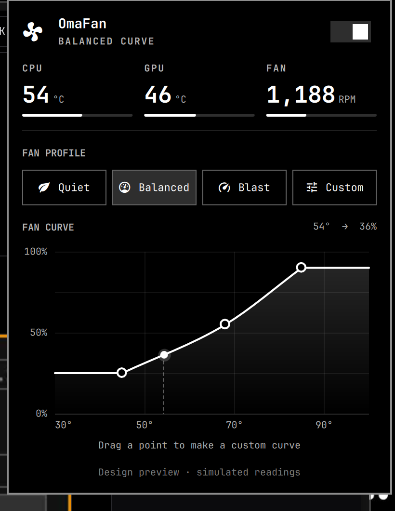

# OmaFan

Fan profiles and a custom fan curve for the Framework Desktop, right in the Omarchy bar.



> **Status: design preview.** The panel runs on simulated readings and does not touch the fans yet.

## Planned

- Live CPU, GPU, and fan readings from the embedded controller (`cros_ec`, `k10temp`, `amdgpu`)
- Quiet, Balanced, and Blast profiles, plus a custom curve with three draggable points
- A toggle that hands control back to the firmware's automatic fan curve

## Try the preview

```bash
cp -r omarchy/local.omafan ~/.config/omarchy/plugins/
omarchy plugin enable local.omafan --section right
```

Remove it with `omarchy plugin remove local.omafan`.

## License

[MIT](LICENSE)
