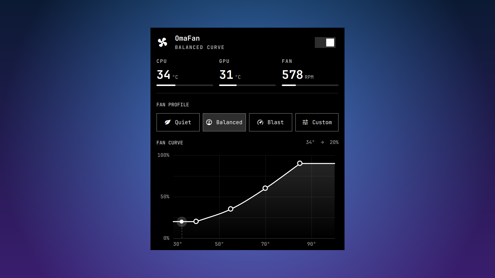

<p align="center">
  
</p>

<h1 align="center">OmaFan</h1>

<p align="center">Fan profiles and fan curves for the Framework Desktop, in the Omarchy bar.</p>

- Live CPU, GPU, and fan readings
- Quiet, Balanced, and Blast profiles, or drag four points to draw your own curve
- One switch hands the fans back to the firmware

## Install

```bash
git clone https://github.com/Aayush9029/OmaFan.git
cd OmaFan
./install.sh
```
